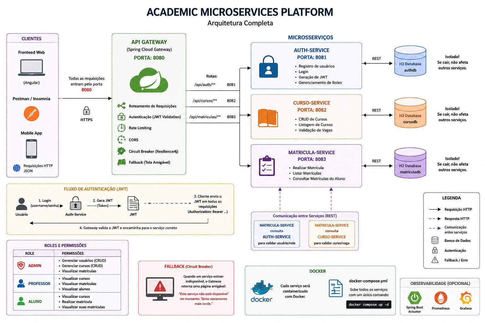

# Arquitetura Geral do Sistema

## Objetivo

Construir uma plataforma acadêmica baseada em microserviços utilizando:

* Spring Boot
* JWT Authentication
* Spring Cloud Gateway
* Circuit Breaker (Resilience4j)
* Docker
* H2 Database

---

## Arquitetura

---

## Componentes

### API Gateway (8080)

Responsável por:

* Centralizar requisições
* Validar JWT
* Encaminhar chamadas para os serviços corretos
* Aplicar Circuit Breaker
* Exibir mensagens de fallback

---

### Auth Service (8081)

Responsável por:

* Cadastro de usuários
* Login
* Geração de JWT
* Controle de Roles

Banco:

* h2-auth

---

### Curso Service (8082)

Responsável por:

* CRUD de cursos
* Consulta de cursos
* Controle de vagas

Banco:

* h2-curso

---

### Matricula Service (8083)

Responsável por:

* Matrículas
* Consulta de matrículas
* Comunicação com Auth Service
* Comunicação com Curso Service

Banco:

* h2-matricula

---

## Roles

### ROLE_ADMIN

* Gerenciar usuários
* Gerenciar cursos
* Visualizar matrículas

### ROLE_PROFESSOR

* Visualizar cursos
* Visualizar alunos
* Visualizar matrículas

### ROLE_ALUNO

* Visualizar cursos
* Realizar matrícula
* Visualizar suas matrículas

---

## Comunicação entre Serviços

Matricula Service consulta:

* Auth Service para validar usuário
* Curso Service para validar curso e vagas

---

## Docker

Todos os serviços serão executados através de um único docker-compose.yml.
